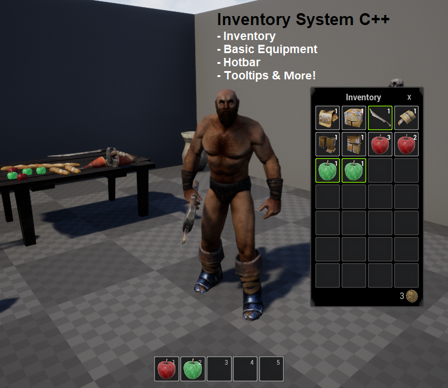
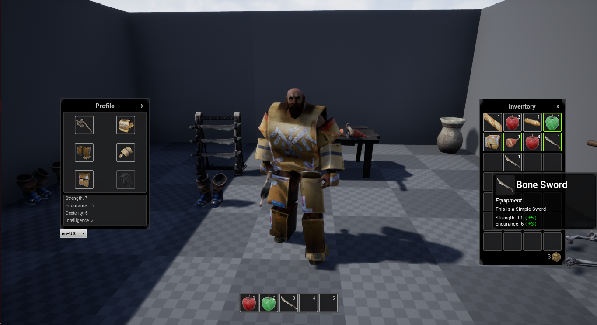
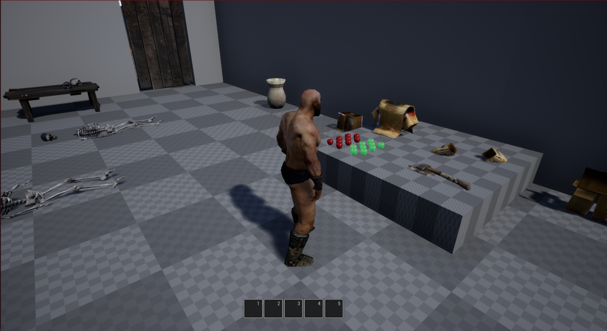
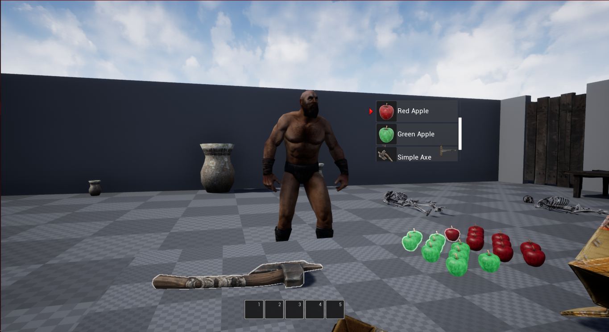
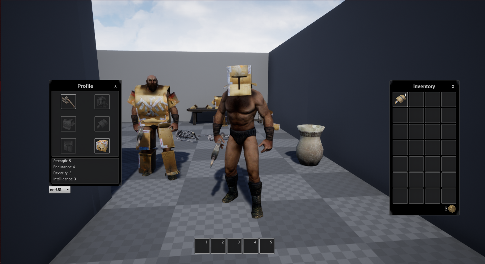
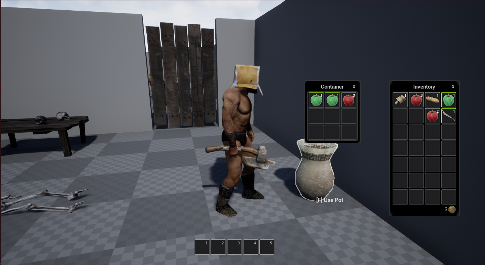
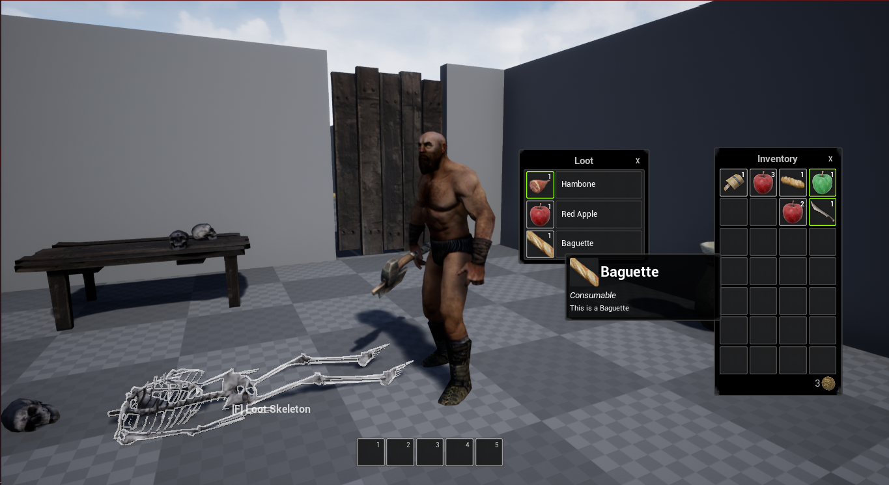

# Inventory System CPP

<!---->

## About
The Inventory System CPP project contains a basic multiplayer supported inventory system featuring equip-able and usable items. The project is developed essentially on C++.

The technical demo included is an MMO styled example with a Drag & Drop UI. This demo showcases how quick it is to implement and use the Inventory System in your own project.

## Features:                                               
• Single Player and Multiplayer basic support.              
• Configurable equipment and items.                         
• Customizable player equipment types and slots.            
• Create new items quickly and with ease.                   
• Practical and easy to modify ‘Drag & Drop’ UI example.    
• Move, drop, use, equip, unequip items.                    
• Includes Usable, Equipment, and Consumable item examples.  
• Dynamic Tooltips.									        
• Hotbar included.									   	    
• Support for Localization.								    
• The project is compatible with Windows and Android.  

This is not an RPG Starter Kit and the practical examples and items demonstrating how to easily use the Inventory System CPP are a bonus.
   

Multiplayer Support

Container and Loot

Tooltips will show you if it's whorthy or not to equip one item by displaying the difference on stats.

### Controls
WASD : To move  
I : Open Inventory  
P : Open Profile  
RMB : Interact w/ Items  
F : Collect Items, and, Use Pot/Loot  
Left+Alt : Swap between "GameModeOnly" and "GameAndUIMode"  
Escape : Quit Game

There are a few videos showing its features as well:  
Project Overview : [RPG InventorySystem C++ | Unreal Engine](https://www.youtube.com/watch?v=oyq-Yn8kdJI)  
Multiplayer Sample : [Multiplayer System WIP | RPG InventorySystem UE4 C++ - YouTube](https://www.youtube.com/watch?v=1obDlJyLR7Q)  

## Author 
Developer: David Ricardo
